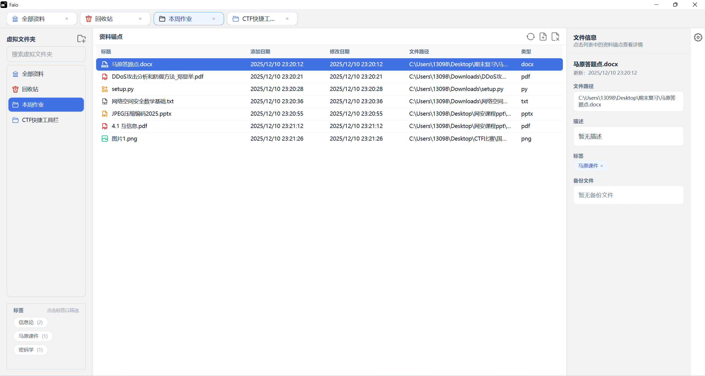
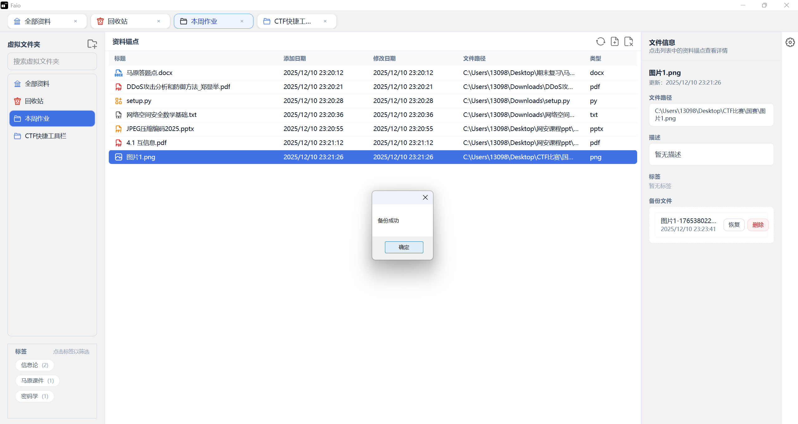
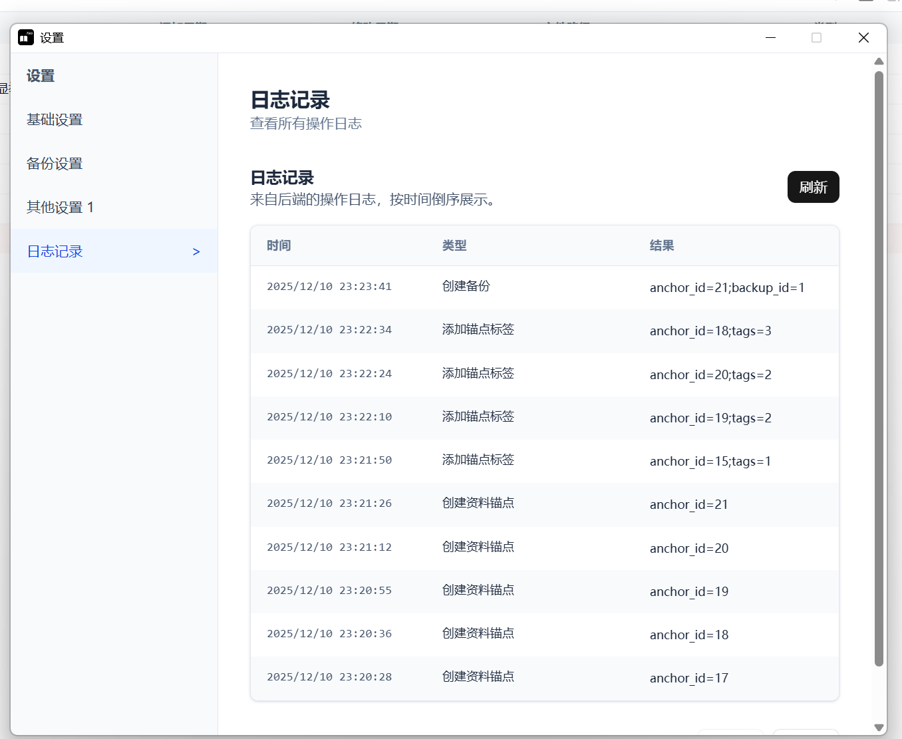
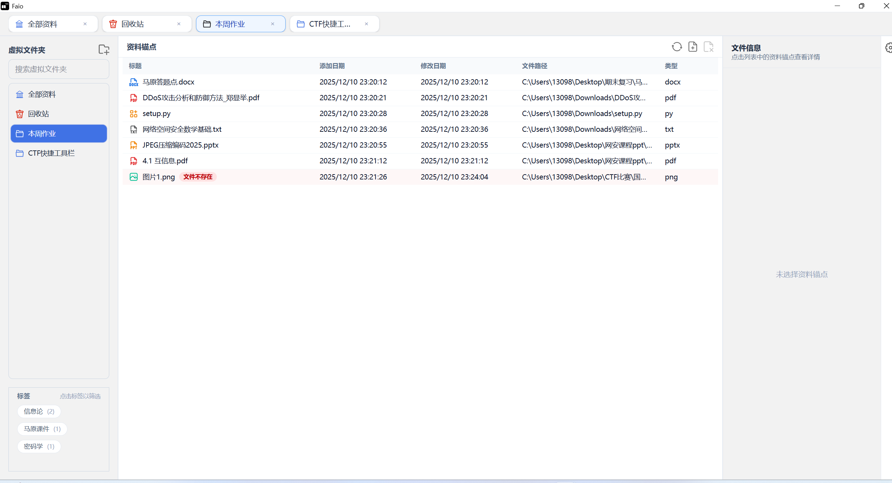

# Faio (Files All in One)

  

用于整理、标注、备份本地文件的跨平台工具。通过虚拟文件夹、标签、备份与操作日志，一键打开原文件或所在目录；解决桌面文件夹与快捷方式过多导致混乱、效率下降的问题。当前处于测试阶段，会持续迭代。

### 演示

  <video src="display/演示视频1.mp4" controls width="480">
    您的浏览器不支持视频标签。
  </video>

  

  

  

  

### 平台优先级
1. Windows 桌面
2. macOS / Linux（待适配）
3. 浏览器纯前端模式（不支持本地打开/定位文件）

### 功能
- 虚拟文件夹：创建/重命名/删除，拖拽绑定锚点，回收站。
- 资料锚点：标签、描述、重命名、快捷删除。
- 本地直达：右键打开文件或所在目录（pywebview 桥接）。
- 备份与恢复：单锚点备份、恢复、删除备份记录，支持自定义备份路径。
- 标签与搜索：标签筛选、关键词搜索快速定位。
- 操作日志：设置页查看后端操作日志，分页（10 条/页），可刷新。
- 类型图标：根据文件类型显示对应图标（doc/docx/ppt/pdf/txt/photo/其他）。

### 获取与使用
- 在 GitHub Releases 下载可执行程序，下载后直接运行。
- 右键资料锚点：打开文件 / 打开所在目录 / 备份 / 重命名 / 添加标签 / 删除；设置页可查看操作日志。
- 浏览器纯前端模式无法调用本地文件/目录，请在 pywebview 桌面环境运行。

### 说明与限制
- 仅管理本地文件，不提供第三方数据源。
- 所有文件操作基于数据库映射，不直接操作任意本地文件，避免误删或数据丢失。
- 本地文件读写需遵守系统/组织安全策略，权限由用户自行承担。

### 许可证
MIT or Apache-2.0
